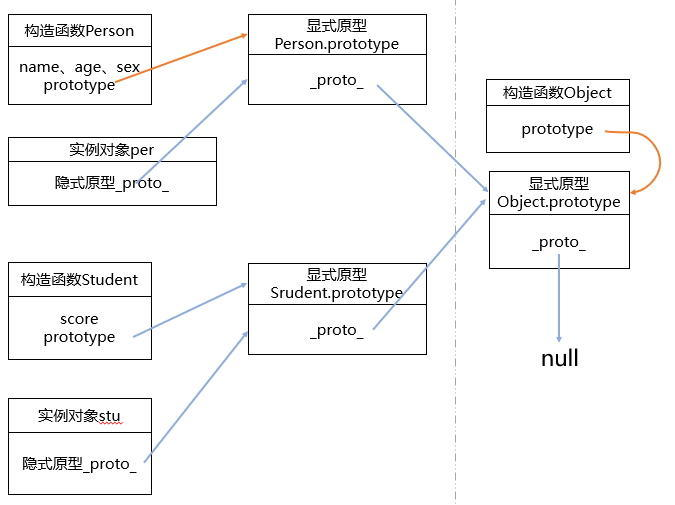
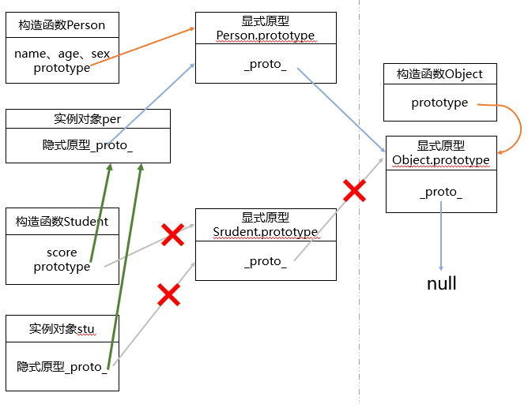

# 原型和原型链

## 构造函数

构造函数具有 `prototype` 属性，指向原型对象；原型对象具有 `constructor` 属性，指向构造函数。

```javascript
function Person(name,age,sex){

    this.name = name;

    this.age = age;

    this.sex = sex;

}

function Student(score){

    this.score = score;

}

var per = new Person("小明"，20, "男");

var stu = new Student(98);
```

未发生继承关系时，原型链图如下：



```javascript
function Person(name,age,sex){
 
    this.name = name;

    this.age = age;

    this.sex = sex;

}

function Student(name,age,sex,score){

    Person.call(this,name,age,sex);  

    this.score = score;

}

Student.prototype = new Person();  // 这里改变了原型指向，实现继承
 
var stu = new Student("小明", 20, "男" ,99); //创建了学生对象stu
```

发生继承关系时，原型链图如下：

